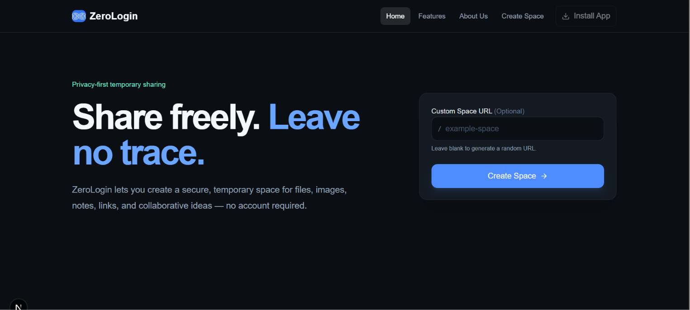
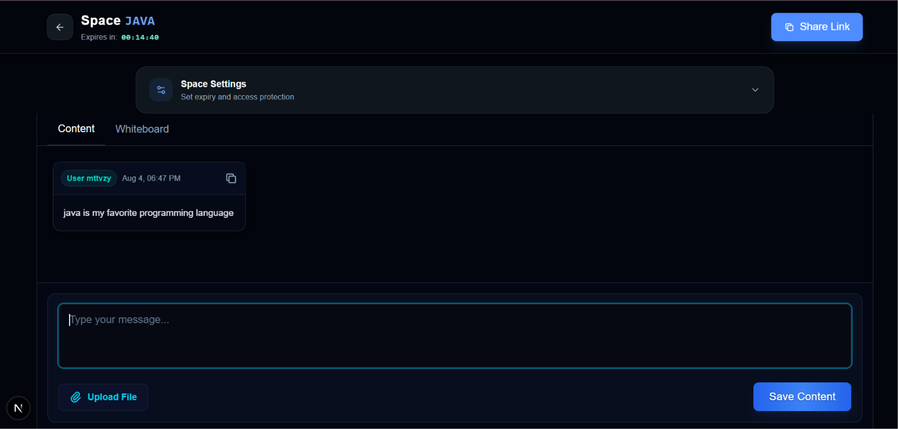
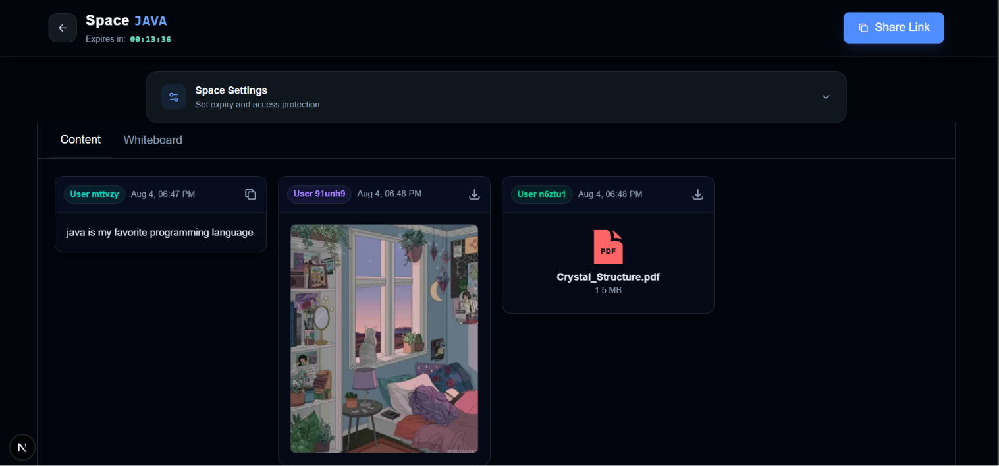
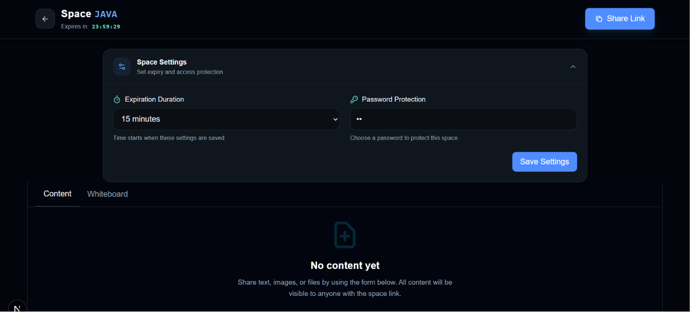
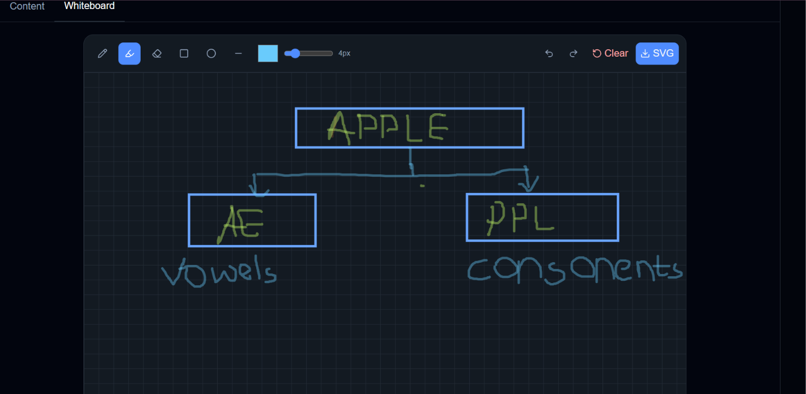
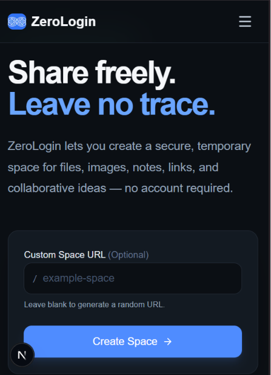

# 🚀 ZeroLogin

> **Share freely. Leave no trace.**

ZeroLogin is a modern, privacy-first temporary sharing platform that allows users to create anonymous spaces to securely share files, images, text notes, links, and collaborate without creating an account.

---

## 🌐 Live Demo

🔗 https://zerologin.vercel.app


# ✨ Features

- 🔒 Anonymous Sharing
- 🚫 No Registration Required
- 📁 Temporary Spaces
- 🔗 Custom Space URLs
- 🔐 Password Protected Spaces
- ⏳ Automatic Expiration
- 📂 File Sharing
- 🖼️ Image Sharing
- 📝 Text Notes
- 🌍 URL Sharing
- 🖱️ Drag & Drop Upload
- 🎨 Collaborative Whiteboard
- 📦 ZIP Download
- 📱 Progressive Web App (PWA)
- 📲 Installable on Mobile & Desktop
- 📱 Fully Responsive Design
- ⚡ Fast & Lightweight
- 🔐 Privacy First

---

# 🛠️ Tech Stack

### Frontend

- Next.js 16
- React 19
- TypeScript
- Tailwind CSS
- Framer Motion
- Lucide React
- Zustand

### Backend

- Next.js Route Handlers

### Database

- Upstash Redis

### PWA

- Service Worker
- Web Manifest

### Deployment

- Vercel

---

# 📸 Application Screenshots
## Home



---

## Create Space



---

## Space



---
## Space settings



---

## Whiteboard



---

## Mobile View



---

# ⚙️ Installation

Clone the repository

```bash
git clone https://github.com/SnehaAN144/zerologin.git
```

Go into the project

```bash
cd zerologin
```

Install dependencies

```bash
npm install
```

Create a `.env.local` file and configure your environment variables.

Start the development server

```bash
npm run dev
```

Open:

```
http://localhost:3000
```

---

# 🚀 Usage

1. Open ZeroLogin.
2. Create a new Space.
3. (Optional) Choose a custom Space URL.
4. Share the generated link.
5. Upload files, images, notes, or links.
6. Collaborate using the Whiteboard.
7. Share anonymously.
8. Content expires automatically.

---

# 🔮 Future Improvements

- 🔄 Real-time collaboration
- 👥 Live presence indicators
- 📹 Voice & video sharing
- 📋 Markdown editor
- 📊 Storage usage insights
- 🌍 Multi-language support
- 📱 Native mobile application
- 🗂️ Folder upload support
- 📦 Bulk downloads
- 🔍 Search within spaces
- ☁️ Cloud storage integrations

---

# 👩‍💻 Contributor

### Sneha Arun Naik

**4th Year Undergraduate | Aspiring Software Engineer**

GitHub:

```
https://github.com/SnehaAN144
```

Email:

```
snehanaik144@gmail.com
```

---
